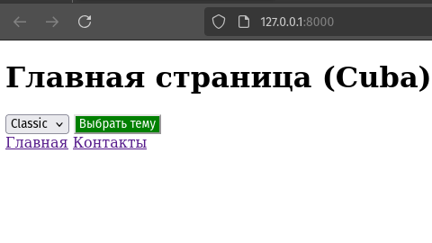
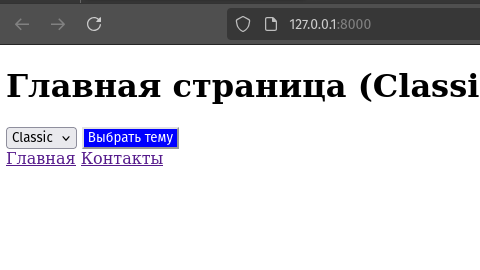
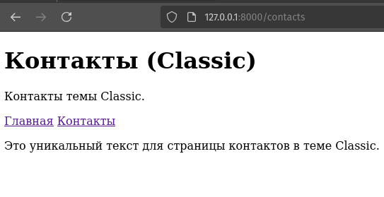
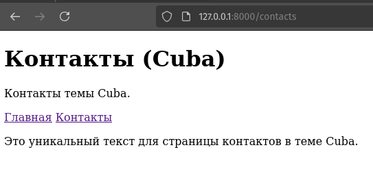

# Тестовое задание
Создать чистый ларавел Создать две темы с названиями (classic, cuba). Они должны лежать в views/themes/{name}/…
Сделать две страницы (главная и контакты).
На главной странице будет форма с select и кнопкой сохранить. (Выбор темы)
На станице контакты любой текст, который должен находится в компоненте (у каждой темы текст должен отличаться).
На каждой странице навигация по разделам.
У каждой темы дизайн кнопки уникальный (главное должно отличаться). Достаточно только стили
кнопки (плюсом будет и другие элементы стилизировать). Стили кладём в public в соответствующую названию темы.

# Установка
```bash
git clone https://github.com/saydum/lara_themes_example
cd lara_themes_example

composer install

php artisan serve

INFO Server running on [http://127.0.0.1:8000]
```

# Результат

|                                                     |                                                     |
|-----------------------------------------------------|-----------------------------------------------------|
|  |  |
|  |  |

